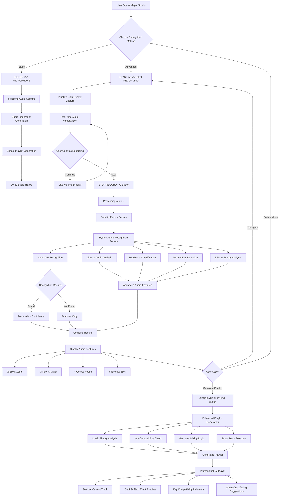

# 🎵 Advanced Audio Recognition User Flow

## 📊 Complete User Journey Flowchart



## 🔄 Detailed Step-by-Step User Flow

### **Phase 1: Entry Point**
```
📱 User Opens Magic Studio
   ↓
🎯 Sees Two Recording Options:
   • Basic: "LISTEN VIA MICROPHONE" (8-second capture)
   • Advanced: "START ADVANCED RECORDING" (user-controlled)
```

### **Phase 2: Advanced Recording Journey**

#### **Step 1: Initiation**
```
🎤 User Clicks "START ADVANCED RECORDING"
   ↓
⚙️  System Initializes:
   • WebRTC high-quality audio capture
   • Sample rate: 44.1kHz
   • Real-time analysis setup
   • Recording timer starts
```

#### **Step 2: Real-time Feedback**
```
📊 Live Audio Visualization:
   • Volume meter with gradient colors
   • Recording time counter (0.1s precision)
   • Pulsing "STOP RECORDING" button
   • Real-time audio level display
```

#### **Step 3: User Control**
```
⏹️  User Clicks "STOP RECORDING"
   ↓
🔄 Processing Phase:
   • Audio buffer captured
   • Converting to base64
   • Sending to Python service
   • Status: "Processing audio..."
```

### **Phase 3: Python Service Analysis**

#### **Backend Processing Pipeline**
```
🐍 Python Service Receives Audio
   ↓
🔍 Recognition Attempt:
   • AudD API call for track identification
   • Confidence scoring
   • Metadata extraction
   ↓
🧠 Advanced Audio Analysis:
   • Librosa audio processing
   • BPM detection via beat tracking
   • Musical key estimation
   • MFCC feature extraction (13 coefficients)
   • Spectral centroid analysis
   ↓
🎵 ML Genre Classification:
   • KNN classifier on MFCC features
   • Genre prediction (electronic, house, techno, etc.)
   • Confidence scoring
   ↓
🎼 Music Theory Analysis:
   • Major scale identification
   • Harmonic compatibility scoring
   • Energy level calculation
```

### **Phase 4: Results Display**

#### **Feature Visualization**
```
📋 Audio Features Card:
┌─────────────────────────────┐
│ 🎵 Detected Features        │
├─────────────────────────────┤
│ BPM: 128.5     Key: C       │
│ Genre: House   Energy: 85%  │
└─────────────────────────────┘
   ↓
🎯 Generate Playlist Button Appears
```

### **Phase 5: Intelligent Playlist Generation**

#### **Enhanced Algorithm**
```
🎵 User Clicks "GENERATE PLAYLIST"
   ↓
🧮 Smart Selection Process:
   • Key compatibility analysis
   • BPM range matching (±6 BPM)
   • Genre coherence
   • Energy curve optimization
   • Harmonic mixing logic
   ↓
🎼 Music Theory Integration:
   • Major scale note sharing (5+ notes = compatible)
   • Camelot wheel positioning
   • Transition smoothness scoring
   ↓
✨ Playlist Generated:
   • 20-30 compatible tracks
   • Enhanced with audio features
   • Compatibility scores
   • Recognition source tagging
```

### **Phase 6: Professional DJ Interface**

#### **Dual Deck Experience**
```
🎛️  Professional Player Loads:
┌─────────────┬─────────────┐
│   DECK A    │   DECK B    │
│ (Current)   │  (Next/Cue) │
├─────────────┼─────────────┤
│ 🎵 Track 1  │ 🎵 Track 2  │
│ Key: C      │ Key: G      │
│ BPM: 128    │ BPM: 132    │
│ ✅ Compatible│ ⚡ +4 BPM   │
└─────────────┴─────────────┘
   ↓
🎯 Smart Features Available:
   • Key clash warnings
   • Harmonic mixing suggestions
   • Tempo sync recommendations
   • Energy curve visualization
```

## 🎯 User Decision Points

### **Critical Choice Moments:**

1. **Recording Method Selection**
   - Basic (quick, simple)
   - Advanced (detailed, professional)

2. **Recording Duration Control**
   - User decides when to stop
   - Real-time feedback guides decision

3. **Post-Analysis Actions**
   - Generate playlist immediately
   - Try recording again
   - Switch to different mode

4. **Playlist Interaction**
   - Accept generated playlist
   - Modify track selection
   - Start DJ session

## 🔧 Technical Flow Behind the Scenes

### **Data Pipeline:**
```
Audio Buffer → Base64 Encoding → HTTP POST
   ↓
Python Service → AudD API → Librosa Analysis
   ↓
Features Object → Playlist Algorithm → Track Database
   ↓
Enhanced Tracks → UI Display → User Interaction
```

### **Error Handling Flow:**
```
Service Failure → Fallback Processing → Mock Features
   ↓
Graceful Degradation → User Notification → Alternative Options
```

## 🎨 UI/UX Experience Flow

### **Visual Progression:**
1. **Initial State**: Clean interface with clear options
2. **Recording State**: Animated, engaging real-time feedback
3. **Processing State**: Professional loading indicators
4. **Results State**: Rich feature display with actionable insights
5. **Generation State**: Smooth transition to playlist creation
6. **Player State**: Professional DJ interface with smart suggestions

### **Feedback Mechanisms:**
- ✅ **Visual**: Color-coded status indicators
- 🔊 **Audio**: Real-time volume visualization
- 📱 **Haptic**: Button press feedback
- 📝 **Text**: Clear status messages
- ⏱️ **Temporal**: Progress indicators and timers

This comprehensive flow transforms a simple "Coming Soon" placeholder into a **professional-grade audio recognition experience** that guides users through each step with clear feedback and intelligent automation! 🎧✨