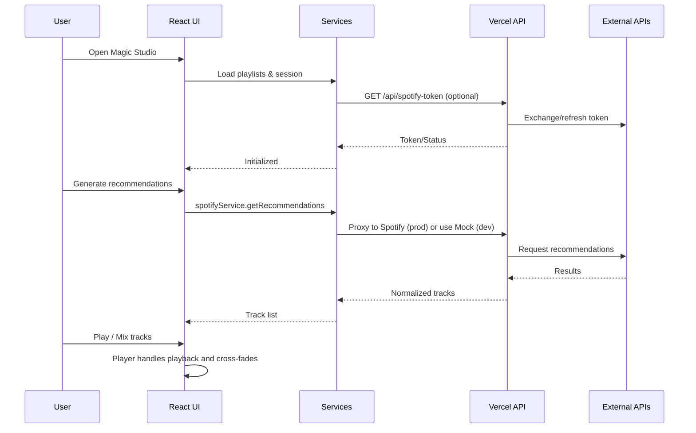

# The New Magic DJ — System Overview

This document provides a comprehensive, multi‑perspective analysis of the codebase covering architecture, developer quality review, and product alignment. It includes diagrams for system architecture, data flow, and core workflows.

## Table of Contents
- Executive Summary
- Software Architect Perspective
- Software Developer Perspective
- Product Manager Perspective
- Appendices

---

## Executive Summary
The New Magic DJ is a TypeScript/React (Vite) web application with serverless API endpoints (Vercel) and optional Supabase integration. It offers an AI‑assisted DJ experience: playlist creation/editing, smart recommendations (mock and production modes), YouTube discovery, audio playback with professional features, and robust end‑to‑end QA via Playwright.

Key strengths:
- Clear separation between UI, domain services, and serverless APIs.
- Strong resilience primitives: retries, timeouts, circuit breaker, idempotency, and rate limiting.
- Thoughtful QA/validation with realistic flows and deployment safety checks.

Key risks/opportunities:
- Credentials/config detection and demo/mocked modes are implicit in places; standardize feature flags.
- Expand unit tests for services and utilities to complement E2E.
- Tighten CSP and secrets handling; align API auth consistently across all API routes.

---

## Software Architect Perspective

### Architecture & Design
The system is a client‑heavy SPA with serverless backends for third‑party API brokering. Frontend consumes internal services that encapsulate external dependencies and resilience logic.

```mermaid
C4Context
title System Context
Person(user, "DJ/Creator")
System_Boundary(app, "The New Magic DJ"){
  System(spa, "React SPA", "Vite + TS")
  System_Ext(vercel, "Serverless API", "Vercel Functions")
  System_Ext(supabase, "Supabase", "Auth/DB (optional)")
}
Rel(user, spa, "Creates playlists, plays mixes")
Rel(spa, vercel, "REST calls", "fetchWithRetry + circuit breaker")
Rel(spa, supabase, "SDK (optional)")
Rel(vercel, External, "Spotify/YouTube/Audd/AcoustID")
```

Design patterns and notable choices:
- Service façade and strategy: `spotifyService` routes calls to `mockSpotifyService` or `productionSpotifyService` based on environment/credentials.
- Resilience layer: `src/utils/http.ts` provides timeouts, retries with jittered backoff, and a per‑URL circuit breaker.
- API reliability: `api/*` endpoints use idempotency (`utils/idempotency.ts`) and rate limiting (per‑user/IP token buckets in handlers + `src/utils/rateLimiter.ts` in FE).
- Error normalization: `src/utils/errors.ts` consolidates error shapes for consistent UI handling.
- UI composition: React functional components and hooks; clear component boundaries (e.g., `ProfessionalMagicPlayer`, `MagicStudio`, `PlaylistEditor`).

Rationale:
- Client‑heavy architecture reduces server load and scales read interactions via CDN while confining privileged tokens to serverless endpoints.
- Strategy pattern for Spotify makes local dev and demo mode frictionless.
- Resilience primitives minimize user‑visible failures due to flaky third‑party APIs.

### Component Interactions & Data Flow

```mermaid
flowchart LR
  UI[React Views/Components]\n(MagicStudio, Player, Editor)
  Hooks[Custom Hooks]\n(useSpotifyToken, useLocalStorage, useToast)
  Services[Domain Services]\n(playlistService, youtubeService, spotifyService)
  API[/Serverless API\n(Vercel)/]
  Ext[(Spotify / YouTube / Audd / AcoustID)]
  SB[(Supabase)]

  UI --> Hooks
  UI --> Services
  Services --> API
  API --> Ext
  UI --> SB

  subgraph Resilience
    HTTP[fetchWithRetry + CircuitBreaker]
    IDEMP[Idempotency]
    RL[Rate Limiting]
  end

  Services --> HTTP
  API --> IDEMP
  API --> RL
```

Operational flow example (Spotify recommendations):
1. UI requests recommendations via `spotifyService`.
2. Service uses mock or production implementation depending on environment.
3. Production service calls serverless API (if present) or Spotify, using `fetchWithRetry`.
4. Results are normalized to internal `Track` type and returned to UI.

### Scalability & Limitations
- Frontend scales trivially on static hosting (Vercel/Netlify). Caching static assets is commonplace.
- Serverless functions scale horizontally; per‑request cold starts can affect p99 latencies.
- Token bucket rate limiting in `api/*` is in‑memory per instance — bursts across instances may bypass limits. Consider durable rate limiting (Upstash Redis, Vercel KV) for production.
- Idempotency cache is in‑memory; responses aren’t shared across instances. Use a shared store for strict guarantees.
- Circuit breaker is client‑side per‑tab/session; helpful for UX but not a systemic safeguard.

---

## Software Developer Perspective

### Code Structure & Quality
- Frontend: `src/components/*`, `src/services/*`, `src/utils/*`, `src/hooks/*`, `src/types/*` — clean modular boundaries.
- API: `api/audd.ts`, `api/acoustid.ts`, `api/spotify-token.ts` — focused handlers with validation, rate limiting, and error handling.
- Utilities: `http.ts` (timeouts/retry/circuit breaker), `errors.ts`, `idempotency.ts`, `rateLimiter.ts` — solid resilience toolkit.
- Tests: Playwright E2E under `tests/` with environment docs. Little to no unit tests visible.

Notable quality positives:
- Consistent TypeScript types and readonly patterns in services.
- Defensive coding in player: listener cleanup, throttled errors, and fallbacks.
- Centralized logging via `utils/logger.ts` and error normalization.

Potential issues/code smells:
- Environment detection in `spotifyService.shouldUseMock()` mixes `import.meta.env` and `process.env`. Consolidate via a config module and explicit feature flags.
- In‑memory idempotency and token buckets reduce cross‑instance guarantees.
- CSP in `netlify.toml` includes `'unsafe-inline'` and `'unsafe-eval'`; tighten if feasible.
- Duplicate retry/timeout implementations exist in API handlers (`acoustid.ts` redefines fetchWithTimeout); prefer a shared module under `api/`.
- Some long components (e.g., `ProfessionalMagicPlayer.tsx`) could be split into smaller units (render logic, audio controller, waveform renderer) for readability.

### Maintainability & Refactoring Targets
- Create a `src/config.ts` and `api/config.ts` for feature flags, endpoints, and environment normalization.
- Extract audio control logic from `ProfessionalMagicPlayer` into a dedicated hook (e.g., `useDualDeckPlayer`) to isolate state transitions and timers.
- Deduplicate HTTP utilities in API routes; add a tiny internal client with consistent error mapping.
- Consider adopting a query library (e.g., TanStack Query) for data fetching, caching, and retries (optional — current utilities are fine, but conventions help).
- Ensure DRY across services regarding validation and normalization of `Track` objects.

### Security Review (OWASP Oriented)
- Secrets boundary: Spotify credentials are gated server‑side; ensure all third‑party calls requiring secrets occur in API routes, not in the browser.
- Rate limiting: Present, but not durable across instances; consider external store to mitigate abuse.
- Idempotency: Good pattern; store is volatile — can be bypassed across instances or restarts.
- CSP: Currently permissive; consider nonces/hashes and removing `'unsafe-eval'` where possible.
- Error handling: Good normalization; verify no raw third‑party error payloads are echoed to clients.
- Supabase: Config present; verify RLS policies enforce least privilege (migrations hint they’re enabled).
- PWA/Service Worker: Present in `public/sw.js`; audit to ensure it doesn’t cache sensitive routes.

Quick fixes:
- Add `helmet`‑equivalent headers in serverless responses for sensitive endpoints (where appropriate).
- Validate and bound all query/body params in `api/*` with clear error codes.
- Audit logs to avoid leaking tokens or PII.

### Testing & Debugging
Current tests:
- Strong Playwright E2E tests focusing on: CORS safety, demo mode, audio playback, API health, performance, deployment protection, and regression guards.

Gaps and recommendations:
- Unit tests for `src/utils/http.ts` (retry budget, circuit states), `utils/errors.ts`, and `utils/idempotency.ts`.
- Service tests for `spotifyService` mode selection, `youtubeService` response normalization and error paths.
- Component tests for PlaylistEditor logic (validation of names, track counts) and `ProfessionalMagicPlayer` state transitions (mocking audio).
- API tests (integration) for `api/audd.ts` and `api/acoustid.ts` using mocked upstreams and verifying rate‑limit + idempotency behavior.

Coverage approach:
- Add Vitest/Jest for unit tests in `src/` and `api/` with mock fetch.
- Keep Playwright for end‑to‑end; add a minimal CI job for unit tests to shorten feedback loops.

---

## Product Manager Perspective

### Feature Alignment to User Stories
- Create and manage playlists: `PlaylistEditor`, `playlistService` with validations and constraints.
- Discover tracks and get recommendations: `spotifyService` (mock/production), `youtubeService` search and details.
- Perform and mix tracks: `ProfessionalMagicPlayer` dual‑deck behavior, cross‑fade/waveforms.
- Run safely in demo or degraded mode: mock Spotify, local audio fallback via `audioFallback.ts`, guarded network utilities.
- Export/share insights: `AnalyticsExport` for data export and visuals.

Business goals alignment:
- Fast onboarding with demo mode when credentials are missing.
- Reliable playback and UX under flaky networks.
- Clear path to production by swapping to durable rate limiting/idempotency stores and tightening security.

### Core User Flows



### Usability & Experience
Strengths:
- Polished, futuristic UI with clear navigation and loading/error feedback.
- Resilient audio playback with graceful fallbacks and visible state transitions.
- QA suite emphasizes real user expectations and known pitfalls.

Opportunities:
- First‑run guide or inline tips explaining mock vs production mode and how to connect real accounts.
- Surface rate‑limit/backoff states in toasts (e.g., “Cooling down after errors”).
- Provide preset “vibes”/templates in Playlist Editor for quick starts.
- Add lightweight telemetry for feature usage (privacy‑respecting) to guide priorities.

---

## Appendices

### Technology Stack
- Frontend: React 18, TypeScript, Vite, TailwindCSS.
- APIs: Vercel serverless (TypeScript), `@vercel/node`.
- Integrations: Spotify, YouTube, Audd, AcoustID, Supabase (optional).
- Testing: Playwright E2E; recommended addition: Vitest/Jest for unit tests.

### Notable Files and Modules
- `src/services/spotifyService.ts` — strategy (mock vs production) for recommendations.
- `src/utils/http.ts` — timeouts, retry with backoff, circuit breaker.
- `src/utils/idempotency.ts` — in‑memory idempotent responses for API.
- `api/audd.ts`, `api/acoustid.ts` — proxied third‑party lookups with rate limiting and timeouts.
- `src/components/ProfessionalMagicPlayer.tsx` — dual‑deck audio player with waveform rendering and cross‑fade logic.
- `tests/` — Playwright QA validation and flows.

### Backlog of Improvements
- Centralize configuration/flags (`config.ts` in app and api) to remove env ambiguity.
- Replace in‑memory rate limit + idempotency with a shared store in production.
- Add unit tests for utilities and services; aim for 70–80% coverage on core modules.
- Tighten CSP and remove `'unsafe-eval'` where practical.
- Extract complex UI logic into custom hooks for readability and reuse.

---

This overview should enable onboarding, guide architectural decisions, and highlight the next most impactful steps for robustness and product quality.

